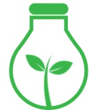

# terrarium

<table style="width: 100%; border-style: none;"><tr>
<td style="width: 140px; text-align: center;"> </a></td>
<td>
<strong>terrarium Developer Environment</strong> 
<i>An immutable Developer Environment for developers working with <b><a href="https://www.opendevstack.org/">OpenDevStacks</a></b> Cloud Quickstarters.
</td>
</table>
With **terrarium** we offer an immutable Developer Environment for developers working with  [OpenDevStack](https://www.opendevstack.org/)** projects. **terrarium** provides the same environment which used to deploy AWS or AZURE components via ODS.

By using the Visual Studio Code Remote - Containers extension it enables the developer to open cloud component repositories inside a container and take advantage of Visual Studio Code's full feature set. 
